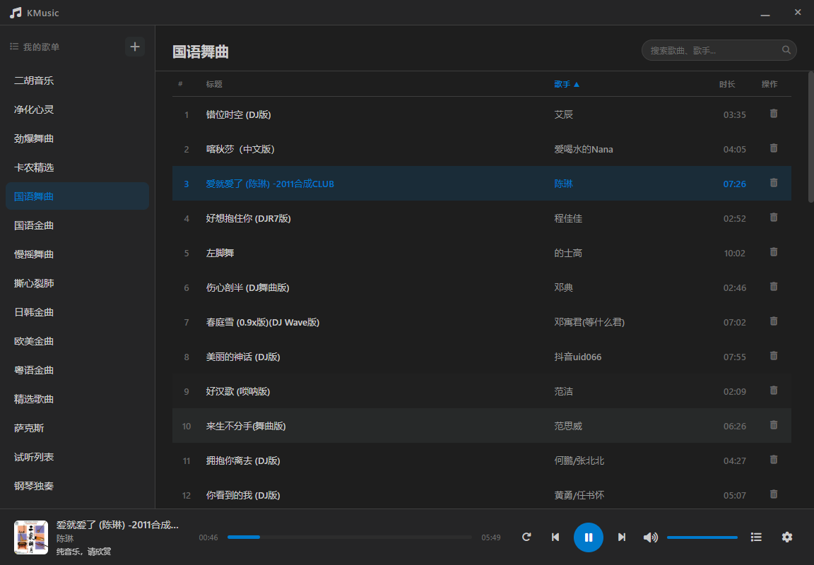
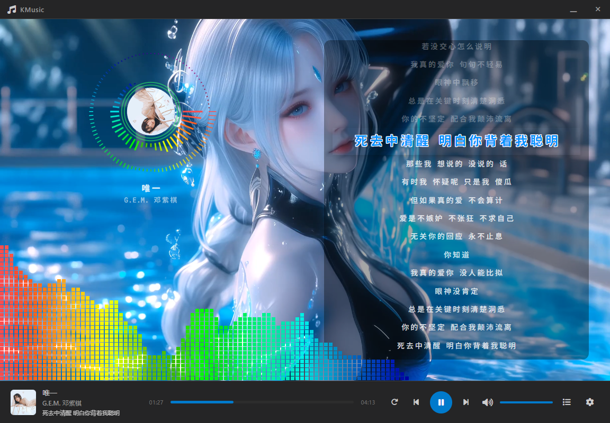
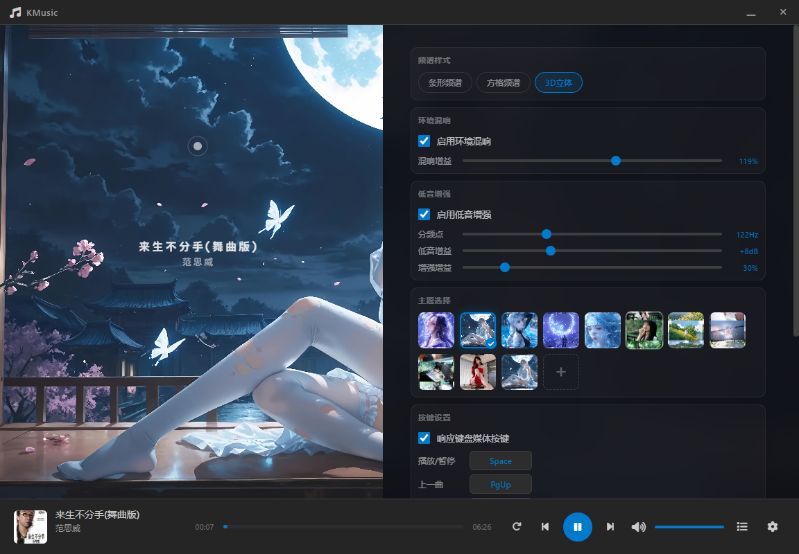

# KMusic

基于 **Electron + Vue 3 + Vite + SQLite** 的本地音乐播放器，采用 Web Audio API 实现实时频谱可视化与音效处理。

## 截图

### 播放列表



### 主界面（频谱可视化）



### 设置页面



## 功能特性

### 音乐管理
- **分组/歌单**：自由创建分组，按专辑、风格或心情整理歌曲
- **批量导入**：支持一次性导入多个音频文件，自动解析元数据（标题、歌手、封面、歌词）
- **扫描目录**：按子目录自动创建分组并导入歌曲，适合整理好的音乐库
- **数据刷新与清理**：重新解析歌曲元数据，清除失效记录

### 音频播放
- 支持 **MP3 / FLAC / WAV / OGG** 等主流音频格式
- **LRC 歌词** 同步显示（底部控制条 + 右侧面板双区域）
- 四种播放模式：顺序 / 单曲循环 / 列表循环 / 随机
- 记忆上次播放进度与歌曲
- 系统托盘常驻，后台播放
- 键盘快捷键（空格键播放/暂停、方向键快进快退、上下键调节音量）

### 频谱可视化
- **条形频谱**（bar）：经典频率柱状图
- **方块频谱**（square）：像素方块风格
- **圆形 3D 频谱**（3d）：封面居中旋转 + 圆形频谱环绕

### 音效处理
| 效果 | 实现方式 | 可控参数 |
|---|---|---|
| 环境混响 | `ConvolverNode` 卷积混响（中厅 IR） | 开关 / 混响增益 (0~200%) |
| 低音增强 | `BiquadFilterNode` (lowshelf) | 开关 / 分频点 / 低音增益 / 增强增益 |

音效架构采用**并行干/湿通路**，混响与低音增强可叠加使用。

### 外观与交互
- 自定义标题栏（Electron 无边框窗口）
- **主题背景**：内置预设 + 自定义图片
- **多媒体按键**：响应键盘媒体键（播放/暂停、上/下一曲）
- 全局搜索歌曲与歌手
- 音量/静音控制，进度条拖拽

## 项目结构

```
KMusic/
├── index.html                  # Vite 入口 HTML
├── package.json                # 项目配置与依赖
├── vite.config.js              # Vite 构建配置
├── run.bat                     # 一键启动开发环境
├── build.bat                   # 一键打包发布
│
├── electron/                   # Electron 主进程
│   ├── main.js                 # 主进程入口：窗口管理、系统托盘、IPC 通信、全局快捷键注册
│   ├── preload.js              # 预加载脚本：contextBridge 暴露安全 API 给渲染进程
│   └── database.js             # SQLite 数据库：分组/歌曲 CRUD、设置持久化、路径归一化
│
├── src/                        # Vue 3 前端代码
│   ├── main.js                 # Vue 应用入口，挂载 Pinia 与全局组件
│   ├── App.vue                 # 根组件：布局骨架、键盘/媒体键事件注册、设置初始化与恢复
│   ├── style.css               # 全局样式（CSS 变量、布局、频谱、播放器、设置面板等）
│   │
│   ├── components/             # Vue 组件
│   │   ├── TitleBar.vue        # 自定义标题栏：窗口最小化/最大化/关闭、应用标题
│   │   ├── Sidebar.vue         # 左侧分组列表：创建/重命名/删除分组，切换分组加载歌曲
│   │   ├── SongTable.vue       # 歌曲列表：搜索过滤、显示歌曲信息（标题/歌手/时长）、双击播放
│   │   ├── PlayerBar.vue       # 底部控制条：播放/暂停、上下曲、进度拖拽、音量控制、歌词同步、音频加载
│   │   ├── SpectrumLayer.vue   # 频谱可视化层：Canvas 绘制条形/方格/3D 频谱、右侧歌词面板自动滚动
│   │   ├── SettingsPanel.vue   # 设置面板：主题切换、频谱模式、音效参数、快捷键录制、数据管理
│   │   ├── GroupModal.vue      # 分组弹窗：新建/重命名分组输入框
│   │   └── ConfirmModal.vue    # 确认弹窗：删除操作二次确认
│   │
│   ├── composables/            # 组合式函数（业务逻辑）
│   │   ├── useApi.js           # 渲染进程 API 封装：通过 IPC 调用 Electron 主进程功能（数据库操作、文件选择等）
│   │   ├── useAudioEngine.js   # Web Audio API 引擎：AudioContext 管理、频谱/3D 视觉数据、混响/低音音效节点
│   │   ├── useVisualizer.js    # Canvas 可视化渲染：条形频谱、方块频谱、3D 圆形频谱的 requestAnimationFrame 绘制循环
│   │   ├── useLyrics.js        # 歌词工具：LRC 解析、纯文本歌词提取、当前行匹配、时间格式化
│   │   └── useShortcuts.js     # 快捷键工具：（保留用于扩展自定义快捷键功能）
│   │
│   └── stores/                 # Pinia 状态管理
│       ├── library.js          # 媒体库状态：分组/歌曲列表、搜索、排序、主题、设置项、UI 弹窗状态
│       └── player.js           # 播放器状态：当前歌曲、播放状态、音量/静音、播放模式、频谱模式、音效参数
│
├── public/                     # 静态资源（字体、图标、默认主题背景）
└── screenshots/                # 截图
    ├── 1.jpg                   # 播放列表
    ├── 2.jpg                   # 主界面（频谱可视化）
    └── 3.jpg                   # 设置页面
```

## 模块职责说明

| 模块 | 层级 | 职责 |
|---|---|---|
| `electron/main.js` | 主进程 | 窗口创建（无边框）、系统托盘（右键菜单）、IPC 处理、全局媒体键注册（MediaPlayPause 等） |
| `electron/preload.js` | 预加载 | 通过 `contextBridge` 暴露 `window.electronAPI`，安全桥接渲染进程与主进程通信 |
| `electron/database.js` | 主进程 | SQLite 数据库初始化、分组/歌曲 CRUD、设置 JSON 读写、文件路径归一化 |
| `src/App.vue` | 根组件 | 布局骨架、全局键盘快捷键监听（空格/方向键）、媒体键事件注册、启动时恢复设置与上次播放状态 |
| `TitleBar.vue` | 组件 | 自定义无边框窗口标题栏，最小化/最大化/关闭按钮 |
| `Sidebar.vue` | 组件 | 分组列表增删改，切换分组触发歌曲加载 |
| `SongTable.vue` | 组件 | 歌曲表格展示、搜索过滤、双击或右键播放 |
| `PlayerBar.vue` | 组件 | 播放控制核心：音频元素管理、播放/暂停/切歌、进度/音量拖拽、歌词同步到 store、音效状态联动 |
| `SpectrumLayer.vue` | 组件 | Canvas 频谱可视化（3 种模式）、歌词面板自动滚动高亮 |
| `SettingsPanel.vue` | 组件 | 主题/频谱/音效/快捷键/媒体键设置、数据扫描/刷新/清除 |
| `useAudioEngine.js` | Composable | Web Audio API 引擎封装：AnalyserNode 频谱数据、3D 视觉效果、混响/低音滤波器链 |
| `useVisualizer.js` | Composable | requestAnimationFrame 渲染循环，在 Canvas 上绘制条形、方块、3D 频谱 |
| `useLyrics.js` | Composable | LRC 时间轴解析、纯文本歌词提取、当前播放行计算 |
| `useApi.js` | Composable | `window.electronAPI` 的 Vue 友好封装 |
| `library.js` | Store | 媒体库状态：分组/歌曲数据、搜索排序、主题/设置持久化 |
| `player.js` | Store | 播放器核心状态：当前歌曲、播放控制、播放模式、音效参数、歌词数据 |

## 技术栈

| 层 | 技术 |
|---|---|
| 桌面容器 | Electron 33 |
| 前端框架 | Vue 3 (Composition API) |
| 状态管理 | Pinia 2 |
| 构建工具 | Vite 6 |
| 数据库 | better-sqlite3（本地 SQLite） |
| 元数据解析 | music-metadata |
| 音频处理 | Web Audio API |
| 图标 | Font Awesome 6 |

## 快速开始

```bash
# 安装依赖
npm install

# 开发模式（Electron + Vite 热更新）
npm run electron:dev
# 或双击 run.bat

# 构建生产版本
npm run electron:build
# 或双击 build.bat
```

## 打包输出

构建产物输出到 `release/` 目录，为便携式 zip 压缩包，解压即用。

## GitHub Actions 自动构建

推送代码到 `main` 分支或创建版本标签（`v*`）时，GitHub Actions 会自动构建 Windows zip 包。

构建产物可在 Actions 页面的 Artifacts 中下载。

## 设置持久化

用户设置（播放模式、主题、音效参数、窗口状态等）自动保存到 `db/settings.json`，下次启动时恢复。

## License

MIT
